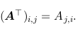

# Applied Math and Machine Learning Basics
## 2 Linear Algebra
### 2.1 Scalars, Vectors, Matrices and Tensors
* scalar: a single number
* vector: an array of numbers
* matrix: 2-D array of numbers
* tensor: an array of numbers arranged on a regular grid with a
variable number of axes is known as a tensor

matrix transpose:  
broadcasting: C = A + b, where A, C are matrces and b is a vector. b is add to
each row of A.

### 2.2 Multiplying Matrices and Vectors
### 2.2 Identity and Inverse Matrices
### 2.3 Linear Dependence and Span
### 2.4 Norms
### 2.5 Special Kinds of Matrices and Vectors
### 2.6 Eigendecomposition
### 2.7 Singular Value Decomposition
### 2.8 The Moore-Penrose Pseudoinverse
### 2.9 The Trace Operator
### 2.10  The Determinant
### 2.11  Example: Principal Components Analysis
