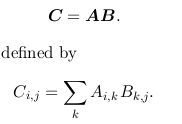
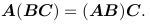
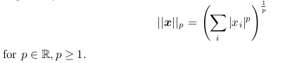

# Applied Math and Machine Learning Basics
## 2 Linear Algebra
### 2.1 Scalars, Vectors, Matrices and Tensors
* Scalar: a single number
* Vector: an array of numbers
* Matrix: 2-D array of numbers
* Tensor: an array of numbers arranged on a regular grid with a
variable number of axes is known as a tensor
* matrix transpose:    
* broadcasting: C = A + b, where A, C are matrces and b is a vector. b is add to
each row of A.

### 2.2 Multiplying Matrices and Vectors
Matrix product:   
* distributive:   
* associative:   
* transpose:   

Hadamard product:  element-wise

### 2.3 Identity and Inverse Matrices
* Identity Matrix:   
* Matrix Inverse:   
Equation  can be solved by , but this is **only for theoretical analysis** for limited precision in computer.

### 2.4 Linear Dependence and Span
  
We can think of the columns
of A (m by n matrix) as specifying different directions we can travel from the origin (the pointspecified by the vector of all zeros), and determine how many ways there are of reaching b .
* Linear combination: multiply a set of vectors with a corresponding scalar
   
Each column of matrix A is a vector, therefore 

* column space or range of A(span of A): set of all points obtainable by linear combination of column vectors of A.

* linearly independence: A set of vectors is linearly independent if no vector in the set is a linear combination of the other vectors. If we add a vector to a set that is a linear combination of the other vectors in the set, the new vector does not add any points to the set’s span.

For  to **have a solution** (the column space of the matrix to encompass all of R^m), it is **necessary and sufficient** the matrix must contain at least one set of m linearly independent columns.  
Reason: 

If we want to solve  with **matrix inverse**(at most one solution for each value of b), matrix has at most m columns. We require that **m = n(square)** and that all of the columns must be **linearly independent**.

For  to **have a solution**, *matrix may not have an inverse, which means A may not be square or square but singular.*

### 2.5 Norms
* Norm: measure size of a vector
  
properties:  

* Euclidean norm(L2 norm): when p = 2, denoted by ||x||, calculated by . Squared L2 norm is **easier for computation**, especially for derivatives. But it is undesirable because it **increases slowly near the origin**. *Sometimes, it's important to discriminate between elements that are exactly zero and elements that are small but nonzero.*

* L1 norm: The L1 norm is commonly used in machine learning when the **difference between zero and nonzero elements is very important**.Every time an element of x moves away from 0 by e , the L1 norm increases by e.

* Max norm: The absolute value of the element with the largest magnitude in the vector 

* Frobenius norm:  analogous to the L 2 norm of a vector

The dot product of two vectors can be rewritten in terms of norms  

### 2.6 Special Kinds of Matrices and Vectors
* Diagonal matrices: have non-zero entries only along the main diagonal

  We write diag(v) to denote a square diagonal matrix whose diagonal entries are given by the entries of the vector v.

  Properties: diagonal matrix is very **computationally efficient**

  In many cases, we may derive some very general machine learning algorithm in terms of arbitrary matrices, but obtain a less expensive (and less descriptive) algorithm by restricting some matrices to be diagonal. (2.12  Example: Principal Components Analysis)

* Symmetric matrix: Any matrix that is equal to its own transpose  

* Unit vector： a vector with unit norm

* Orthogonal: A vector x and a vector y are orthogonal to each other if 

  If both vectors have nonzero norm, this means that they are at a 90 degree angle to each other. In R^n , at most n vectors may be mutually orthogonal with nonzero norm.

* Orthonormal: vectors are orthogonal and have unit norm.

* Orthogonal matrix: a square matrix whose **rows and columns** are **mutually orthonormal**  

  It implies **orthogonal matrices have inverse** and . Orthogonal matrices are of interest because **their inverse is very cheap to compute**

### 2.7 Eigendecomposition
While an integer can be decomposed into prime factors, a matrix have similar decomposition called eigendecomposition.  
***Av = λv***   
where A is a square matrix and v is a vector. Therefore, **multiplying v by A has the same effect of stretching  v by λ.**  

* Eigenvector: v
* Eigenvalue: λ
* left eigenvector: 
* eigendecomposition: a matrix A has n linearly independent eigenvectors, {v(1) , . . . ,v(n)}, with corresponding eigenvalues {λ1 , . . . , λn}.  

Strictly speaking, there is an infinity of eigenvectors associated to each eigenvalue, because any scalar multiple of an eigenvector is still an eigenvector. **So we usually normalize the eigenvectors.**

* positive-semi definite: a matrix which can be obtained as the product of a matrix of real numbers and its transpose.

* positive-semi definite: a matrix whose eigenvalues are all non-negative
* positive definite: a matrix whose eigenvalues are all positive
* negative-semi definite: a matrix whose eigenvalues are all non-positive
* negative definite: a matrix whose eigenvalues are all positive

positive-semi definite matrices are **real symmetric matrices**. They are related to multivariate analysis like *correlation matrices, covariance and cross-product matrices.*

The important properties of a positive semi-definite matrix is
that its eigenvalues are always positive or null, and that **its eigenvectors are pairwise orthogonal when their eigenvalues are different. The eigenvectors are also composed of real values**

***There is a contradictions between http://www.utdallas.edu/~herve/Abdi-EVD2007-pretty.pdf  and deep learning book. It may be a misunderstanding***

In http://www.utdallas.edu/~herve/Abdi-EVD2007-pretty.pdf
>Because eigenvectors corresponding to different eigenvalues are orthogonal, it is possible to store all the eigenvectors in an orthogonal
matrix (recall that a matrix is orthogonal when the product of
this matrix by its transpose is a diagonal matrix).
This implies the following equality:  
U^−1 = U^T. and A = QΛQ^T

When two eigenvectors share the same eigenvalues, I think it is not possible to store the eigenvectors in an orthogonal matrix, which means expression A = QΛQ^T does always not hold.

But deep learning book says
>every real symmetric matrix can be decomposed into an expression using only real-valued eigenvectors and eigenvalues:
*A = QΛQ^T*

Regardless of distinctiveness of eigenvalues, a real symmetric matrix always has such expression.

Procedure to find eigenvalues and eigenvectors:
1. *Av = λv  => (A - λI)v = 0*
2. solve the deterministic equation det(A - λI) = 0. Results are eigenvalues .
3. use eigenvalues to find eigenvectors with definition ***Av = λv***

### 2.8 Singular Value Decomposition
Suppose that A is an m×n matrix.  
***A = UDV^T***   
U is defined to be an m×m matrix, D to be an m×n matrix, and V to be an n×n matrix. The matrices U and V are both defined to be **orthogonal matrices**. The matrix D is defined to be a **diagonal matrix**. Note that D is **not necessarily square.**
### 2.9 The Moore-Penrose Pseudoinverse
### 2.10 The Trace Operator
### 2.11  The Determinant
### 2.12  Example: Principal Components Analysis

## 3 Probability and Information Theory
### 3 .1 Why Probability
### 3.2 Random Variables
### 3.3 Probability Distributions
### 3.4 Marginal Probability
### 3.5 Conditional Probability
### 3.6 The Chain Rule of Conditional Probabilities
### 3.7 Independence and Conditional Independence
### 3.8 Expectation, Variance and Covariance
### 3.10 Common Probability Distributions
### 3.11 Useful Properties of Common Functions
### 3.12 Bayes’ Rule
### 3.13 Technical Details of Continuous Variables
### 3.14 Information Theory
### 3.15 Structured Probabilistic Models

## 4 Numerical Computation
### 4.1 Overflow and Underflow
### 4.2 Poor Conditioning
### 4.3 Gradient-Based Optimization
### 4.4 Constrained Optimization
### 4.5 Example: Linear Least Square

## 5 Machine Learning Basics
### 5.1 Learning Algorithms
### 5.2 Capacity, Overfitting and Underfitting
### 5.3 Hyperparameters and Validation Sets
### 5.4 Estimators, Bias and Variance
### 5.5 Maximum Likelihood Estimation
### 5.6 Bayesian Statistics
### 5.7 Supervised Learning Algorithms
### 5.8 Unsupervised Learning Algorithms
### 5.9 Stochastic Gradient Descent
### 5.10 Building a Machine Learning Algorithm
### 5.11 Challenges Motivating Deep Learning
